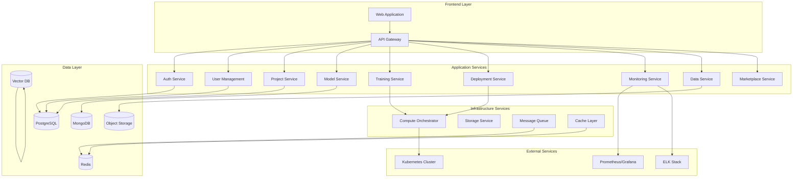

# Advanced AI Model Platform - Design Document

## Overview

The Advanced AI Model Platform is designed as a cloud-native, microservices-based system that provides comprehensive AI/ML lifecycle management. The platform follows a modular architecture with clear separation of concerns, enabling scalability, maintainability, and extensibility.

The system is built on modern technologies including Kubernetes for orchestration, React/TypeScript for the frontend, Node.js/Python for backend services, and supports multiple AI frameworks (TensorFlow, PyTorch, Hugging Face, etc.).

## Architecture

### High-Level Architecture



### Technology Stack

**Frontend:**
- React 18 with TypeScript
- Material-UI for component library
- Redux Toolkit for state management
- React Query for API state management
- Monaco Editor for code editing
- D3.js for data visualizations

**Backend Services:**
- Node.js with Express/Fastify for API services
- Python with FastAPI for ML-specific services
- GraphQL with Apollo Server for flexible data fetching
- JWT for authentication with refresh token rotation

**Infrastructure:**
- Kubernetes for container orchestration
- Docker for containerization
- NGINX for load balancing and reverse proxy
- Istio service mesh for advanced traffic management

**Databases:**
- PostgreSQL for relational data (users, projects, metadata)
- MongoDB for document storage (model artifacts, experiments)
- Redis for caching and session storage
- Elasticsearch for search and analytics
- Qdrant/Pinecone for vector embeddings

**ML/AI Stack:**
- JupyterHub for notebook environments
- MLflow for experiment tracking
- Kubeflow for ML pipelines
- TensorFlow Serving, TorchServe for model serving
- Ray for distributed computing
- Optuna for hyperparameter optimization

## Components and Interfaces

### 1. Authentication Service

**Responsibilities:**
- User registration and login
- JWT token management
- OAuth/SSO integration
- Role-based access control

**Key Interfaces:**
```typescript
interface AuthService {
  register(userData: UserRegistration): Promise<AuthResponse>
  login(credentials: LoginCredentials): Promise<AuthResponse>
  refreshToken(token: string): Promise<AuthResponse>
  validateToken(token: string): Promise<TokenValidation>
  assignRole(userId: string, role: UserRole): Promise<void>
}

interface UserRole {
  id: string
  name: 'admin' | 'developer' | 'viewer' | 'guest'
  permissions: Permission[]
}
```

### 2. Model Management Service

**Responsibilities:**
- Model versioning and metadata storage
- Model artifact management
- Model registry and discovery
- Model lineage tracking

**Key Interfaces:**
```typescript
interface ModelService {
  createModel(modelData: ModelCreation): Promise<Model>
  getModel(modelId: string): Promise<Model>
  updateModel(modelId: string, updates: ModelUpdate): Promise<Model>
  listModels(filters: ModelFilters): Promise<Model[]>
  deleteModel(modelId: string): Promise<void>
  getModelVersions(modelId: string): Promise<ModelVersion[]>
}

interface Model {
  id: string
  name: string
  description: string
  framework: 'tensorflow' | 'pytorch' | 'huggingface' | 'custom'
  version: string
  artifacts: ModelArtifact[]
  metadata: ModelMetadata
  performance: PerformanceMetrics
  createdAt: Date
  updatedAt: Date
}
```

### 3. Training Service

**Responsibilities:**
- Training job orchestration
- Resource allocation and scaling
- Hyperparameter optimization
- Experiment tracking

**Key Interfaces:**
```typescript
interface TrainingService {
  startTraining(config: TrainingConfig): Promise<TrainingJob>
  stopTraining(jobId: string): Promise<void>
  getTrainingStatus(jobId: string): Promise<TrainingStatus>
  listTrainingJobs(filters: JobFilters): Promise<TrainingJob[]>
  optimizeHyperparameters(config: OptimizationConfig): Promise<OptimizationJob>
}

interface TrainingConfig {
  modelId: string
  datasetId: string
  framework: string
  hyperparameters: Record<string, any>
  resources: ResourceRequirements
  optimization: OptimizationSettings
}
```

### 4. Deployment Service

**Responsibilities:**
- Model deployment to various environments
- API endpoint management
- Auto-scaling configuration
- A/B testing support

**Key Interfaces:**
```typescript
interface DeploymentService {
  deployModel(config: DeploymentConfig): Promise<Deployment>
  updateDeployment(deploymentId: string, config: DeploymentUpdate): Promise<Deployment>
  scaleDeployment(deploymentId: string, replicas: number): Promise<void>
  getDeploymentStatus(deploymentId: string): Promise<DeploymentStatus>
  createABTest(config: ABTestConfig): Promise<ABTest>
}

interface DeploymentConfig {
  modelId: string
  environment: 'staging' | 'production'
  resources: ResourceRequirements
  scaling: AutoScalingConfig
  routing: RoutingConfig
}
```

### 5. Monitoring Service

**Responsibilities:**
- Real-time metrics collection
- Performance monitoring
- Data drift detection
- Alert management

**Key Interfaces:**
```typescript
interface MonitoringService {
  collectMetrics(deploymentId: string, metrics: Metrics): Promise<void>
  getMetrics(deploymentId: string, timeRange: TimeRange): Promise<MetricsData>
  detectDrift(deploymentId: string, data: InferenceData): Promise<DriftAnalysis>
  createAlert(config: AlertConfig): Promise<Alert>
  getAlerts(filters: AlertFilters): Promise<Alert[]>
}

interface Metrics {
  accuracy: number
  latency: number
  throughput: number
  errorRate: number
  resourceUsage: ResourceMetrics
}
```

### 6. Data Management Service

**Responsibilities:**
- Dataset storage and versioning
- Data pipeline orchestration
- Data quality monitoring
- Feature store management

**Key Interfaces:**
```typescript
interface DataService {
  uploadDataset(data: DatasetUpload): Promise<Dataset>
  getDataset(datasetId: string): Promise<Dataset>
  createPipeline(config: PipelineConfig): Promise<DataPipeline>
  runPipeline(pipelineId: string): Promise<PipelineRun>
  validateDataQuality(datasetId: string): Promise<QualityReport>
}

interface Dataset {
  id: string
  name: string
  version: string
  schema: DataSchema
  statistics: DataStatistics
  quality: QualityMetrics
  lineage: DataLineage
}
```

## Data Models

### Core Entities

```typescript
// User and Authentication
interface User {
  id: string
  email: string
  name: string
  role: UserRole
  teams: Team[]
  preferences: UserPreferences
  createdAt: Date
  lastLoginAt: Date
}

interface Team {
  id: string
  name: string
  members: TeamMember[]
  projects: Project[]
  permissions: TeamPermissions
}

// Projects and Workspaces
interface Project {
  id: string
  name: string
  description: string
  teamId: string
  models: Model[]
  datasets: Dataset[]
  experiments: Experiment[]
  deployments: Deployment[]
  settings: ProjectSettings
  createdAt: Date
  updatedAt: Date
}

interface Experiment {
  id: string
  name: string
  projectId: string
  modelId: string
  parameters: Record<string, any>
  metrics: ExperimentMetrics
  artifacts: Artifact[]
  status: ExperimentStatus
  startedAt: Date
  completedAt?: Date
}

// Model and Training
interface ModelArtifact {
  id: string
  type: 'model' | 'weights' | 'config' | 'tokenizer'
  path: string
  size: number
  checksum: string
  metadata: Record<string, any>
}

interface TrainingJob {
  id: string
  modelId: string
  status: 'pending' | 'running' | 'completed' | 'failed' | 'cancelled'
  config: TrainingConfig
  progress: TrainingProgress
  logs: string[]
  metrics: TrainingMetrics
  startedAt: Date
  completedAt?: Date
}

// Deployment and Serving
interface Deployment {
  id: string
  modelId: string
  environment: string
  endpoint: string
  status: DeploymentStatus
  replicas: number
  resources: ResourceAllocation
  traffic: TrafficConfig
  createdAt: Date
  updatedAt: Date
}

interface APIEndpoint {
  id: string
  deploymentId: string
  path: string
  method: string
  schema: APISchema
  authentication: AuthConfig
  rateLimit: RateLimitConfig
}
```

### Database Schema Design

**PostgreSQL Tables:**
- users, teams, team_members
- projects, project_members
- models, model_versions
- deployments, endpoints
- experiments, experiment_metrics
- alerts, notifications

**MongoDB Collections:**
- model_artifacts (binary data, large configs)
- training_logs (time-series data)
- inference_logs (request/response data)
- pipeline_runs (execution history)

**Redis Keys:**
- session:{userId} (user sessions)
- cache:model:{modelId} (model metadata cache)
- queue:training (training job queue)
- metrics:{deploymentId} (real-time metrics)

## Error Handling

### Error Classification

```typescript
enum ErrorType {
  VALIDATION_ERROR = 'VALIDATION_ERROR',
  AUTHENTICATION_ERROR = 'AUTHENTICATION_ERROR',
  AUTHORIZATION_ERROR = 'AUTHORIZATION_ERROR',
  RESOURCE_NOT_FOUND = 'RESOURCE_NOT_FOUND',
  RESOURCE_CONFLICT = 'RESOURCE_CONFLICT',
  EXTERNAL_SERVICE_ERROR = 'EXTERNAL_SERVICE_ERROR',
  INTERNAL_SERVER_ERROR = 'INTERNAL_SERVER_ERROR',
  RATE_LIMIT_EXCEEDED = 'RATE_LIMIT_EXCEEDED'
}

interface APIError {
  type: ErrorType
  message: string
  details?: Record<string, any>
  requestId: string
  timestamp: Date
}
```

### Error Handling Strategy

1. **Input Validation**: Use Joi/Zod for request validation with detailed error messages
2. **Service Errors**: Implement circuit breakers for external service calls
3. **Database Errors**: Handle connection failures with retry logic and fallbacks
4. **Training Errors**: Capture and surface ML-specific errors (convergence, resource limits)
5. **Deployment Errors**: Implement health checks and automatic rollback mechanisms
6. **Monitoring**: Use structured logging with correlation IDs for error tracking

### Retry and Resilience Patterns

```typescript
interface RetryConfig {
  maxAttempts: number
  backoffStrategy: 'exponential' | 'linear' | 'fixed'
  baseDelay: number
  maxDelay: number
  retryableErrors: ErrorType[]
}

interface CircuitBreakerConfig {
  failureThreshold: number
  recoveryTimeout: number
  monitoringPeriod: number
}
```

## Testing Strategy

### Testing Pyramid

**Unit Tests (70%)**
- Service layer logic
- Utility functions
- Data validation
- Business rule enforcement
- Target: >90% code coverage

**Integration Tests (20%)**
- API endpoint testing
- Database integration
- External service mocking
- Message queue integration
- Authentication flows

**End-to-End Tests (10%)**
- Critical user journeys
- Model training workflows
- Deployment pipelines
- Cross-service interactions

### Testing Tools and Frameworks

**Backend Testing:**
- Jest for unit testing
- Supertest for API testing
- Testcontainers for integration testing
- Mock Service Worker for external API mocking

**Frontend Testing:**
- React Testing Library
- Jest for unit tests
- Cypress for E2E testing
- Storybook for component testing

**ML Testing:**
- Great Expectations for data validation
- MLflow for model performance testing
- Custom metrics for model drift detection
- Load testing for inference endpoints

### Continuous Testing Pipeline

```yaml
# Example GitHub Actions workflow
name: Test Pipeline
on: [push, pull_request]
jobs:
  unit-tests:
    runs-on: ubuntu-latest
    steps:
      - uses: actions/checkout@v3
      - name: Run unit tests
        run: npm test -- --coverage
      
  integration-tests:
    runs-on: ubuntu-latest
    services:
      postgres: # Test database
      redis: # Test cache
    steps:
      - name: Run integration tests
        run: npm run test:integration
        
  e2e-tests:
    runs-on: ubuntu-latest
    steps:
      - name: Run E2E tests
        run: npm run test:e2e
```

### Performance Testing

- Load testing for API endpoints (Artillery, k6)
- Model inference performance benchmarking
- Database query optimization testing
- Memory and CPU profiling for training jobs
- Scalability testing for concurrent users

### Security Testing

- OWASP ZAP for vulnerability scanning
- Dependency vulnerability scanning
- Authentication and authorization testing
- Data encryption validation
- API security testing (rate limiting, input validation)

This design provides a robust, scalable foundation for building an advanced AI model platform that can handle enterprise-scale workloads while maintaining developer productivity and operational excellence.